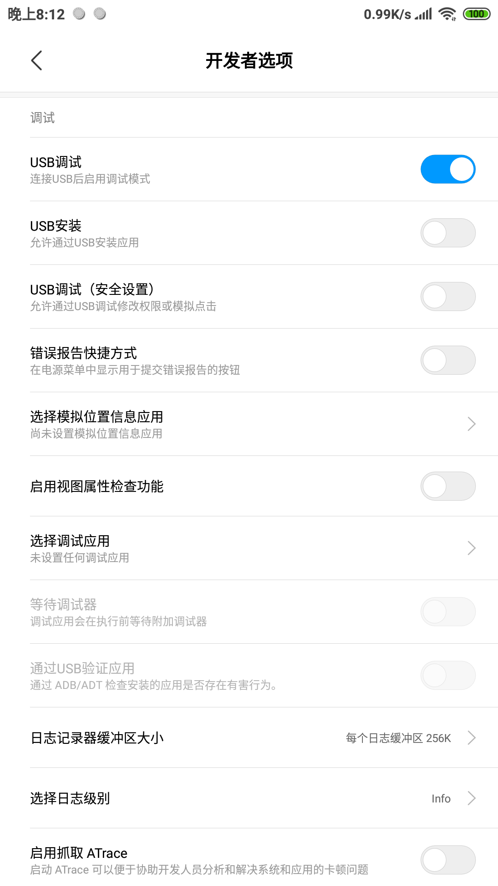
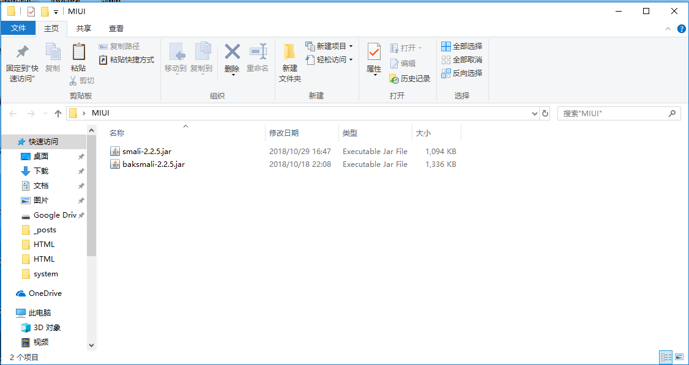
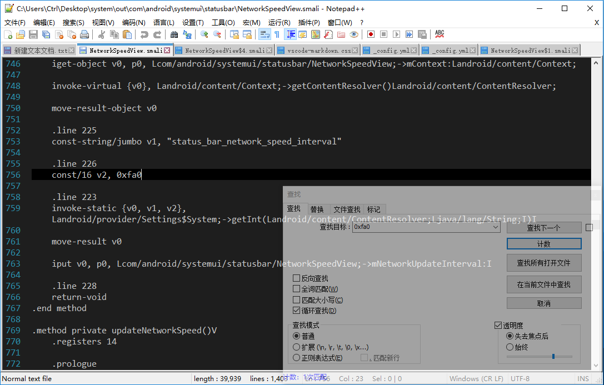

&emsp;`感谢酷安@MSM8998的教程，搬运并适当修改教程仅方便个人查看，如需查看原教程请使用酷安app打开`[原教程](https://www.coolapk.com/feed/8262992)<br>
# 准备工作
- 一台装有Windows 7及以上的PC

- baksmali-xxx.jar、smali-xxx.jar.到[这里](https://bitbucket.org/JesusFreke/smali/downloads/)下载最新的

- AndroidDebugBridge(adb)的安装以及基本操作。可以到[这里](https://androidfilehost.com/?fid=1322778262904007300)下载，安装程序可选将adb加入环境变量中

- Java环境（相关配置请自行百度）

# 操作步骤
- 打开设置——我的设备——全部参数，连击“MIUI版本”开启开发者选项，进入设置——更多设置——开发者选项，找到USB调试选项并打开，之后通过数据线将手机与电脑连接。

<!--  -->


- 在任意位置新建一个文件夹，比如[MIUI]，将下载的baksmali-xxx.jar和smali-xxx.jar放入文件夹内。

<!--  -->


- 点击文件夹的地址栏，复制文件夹的绝对路径，然后Win键+X打开菜单，点击*命令提示符(管理员)(A)* ，在窗口内输入`cd +刚才复制的路径`，回车后进入到MIUI文件夹内。然后使用下面的命令将所需要的文件逐一拉取到文件夹内。

```sh
adb pull /system/framework/
```
```sh
adb pull /system/priv-app/MiuiSystemUI/MiuiSystemUI.apk
```
```sh
adb pull /system/priv-app/MiuiSystemUI/oat/arm64/MiuiSystemUI.odex
```
```sh
adb pull /system/priv-app/MiuiSystemUI/oat/arm64/MiuiSystemUI.vdex
```
- 使用下面的命令反编译MiuiSystemUI.apk，会生成一个名为out的文件夹，我们所需要修改的smali文件就存放在这里面。

```java
java -jar baksmali-2.2.5.jar x MiuiSystemUI.odex -d arm64/
```
- 打开out文件夹下的`com\android\systemui\statusbar`路径，找到`NetworkSpeedView.smali`文件，使用notepad++或其他编辑器打开，Ctrl+F搜索0xfa0，改为0x3e8并保存。



- 使用下面的命令回编译smali文件，生成classes.dex文件。

```java
java -Xmx512M -jar smali-2.2.5.jar a out -o classes.dex
```
-用压缩软件打开MuiSystemUI.apk,将刚才生成的classes.dex文件放入其中，你就得到了一个deodex的MuiSystemUI.apk，你可以将其直接拖入system文件夹进行替换或使用MT管理器进一步修改后替换。
